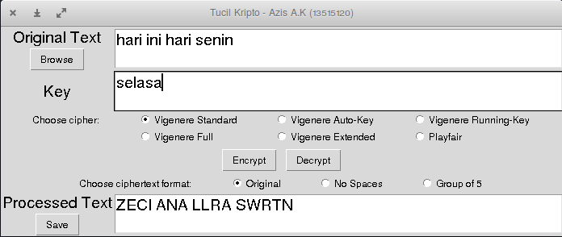

# Tugas Kecil Kriptografi IF 4020

oleh : Azis Adi Kuncoro (13515120)  

### UI
Current user interface: 

### Feature :
  1. Able to input plain text from following interfaces:
      - File (any kind of files)
      - TextField interface
  2. Able to encrypt plain text with various cipher approach
  3. Able to decrypt cipher text
  4. Able to show plain text and cipher text in screen, in form of:
      - Original plain text format
      - Without spacing
      - In group of 5 words
  5. Able to save cipher text to a file
  6. Key typed by user

### Kind of Cipher Algorithm:
  1. Vigenere standard 
  2. 3 kind of Vigenere (Full vigenere, Auto-key, Running-key)
  3. Extended Vigenere
  4. Playfair cipher

### Scope :
  - Only Extended Vigenere that could process any files

### References
  - [Kriptografi klasik - Bagian 2](http://informatika.stei.itb.ac.id/~rinaldi.munir/Kriptografi/2018-2019/Kriptografi-Klasik-Bagian2(2019).pdf)
  